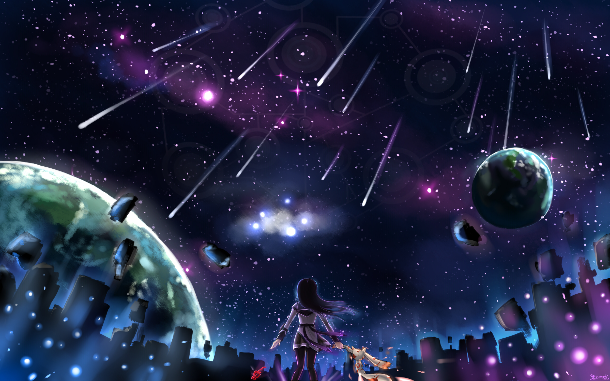

<html lang="en">
<head>
    <meta charset="UTF-8">
    <title>蘑菇の个人网站</title>
</head>
<body>
 
    
<h1>蘑菇</h1>

感谢米娜桑的访问qwq

分享一下可能需要的软件吧（大概只针对设计类）
    
AE（特效，立体，视觉等方面可能用）

2019版非win10系统不能用：https://pan.baidu.com/s/1j4mO1macWhqVlomvDUr56w
密码vkph
17年版本都可以用（反正我用的这个），破解器在里面，安装教程自己找https://pan.baidu.com/s/1N9EzWaqmbWecv9F_Y6o-AQ
密码gtxc

Pr（视频剪辑，估计应该只会在摄影，数媒，社团里面用，里面应该有破解器，没有去其他链接找）https://pan.baidu.com/s/1-vaxHSAsgdq5pFIx8c1P8Q
密码4pau

Ps（设计类估计都要用，用数位板画画也能用这个，或者sai也行，我当年以为这软件烧主板，结果他比ae还烧显卡）
https://pan.baidu.com/s/1xe34roeR7p_O0BIAGxBRlQ
密码snst

Au（这个好像就是高中老师给我们的音频软件的现代版，不用说混音，修音用的，做鬼畜是其他软件）
https://pan.baidu.com/s/1Gg29VA3WDZfEqfR-7nWVfg
密码n3mm

Fl（做动画的，我不会玩，动画专业看看，15年后的版本改名了，自己找吧）
https://pan.baidu.com/s/12Gy8tSjgDzHIhF0p2WatNw
密码c71o
（另外的AI（玩矢量图形的，可能用吧）、Dw(做网站的）、Br等要用的话直接注册Adobe账号下载破解就行了，2017版应该可以破解2019版的

Vegas（像ae和pr结合后的上古版本，新人可以玩玩，反正我当年用几天就卸载了）
https://pan.baidu.com/s/1mKlOxzuT3jLPS59uKhBVBg
密码jndh

LIVE  2d （认识的人都知道干嘛的，不过有限时，时间到了删掉再下就行了） 
https://pan.baidu.com/s/10D6dhLxtmcLX76fsZTR7Yw
密码5gzy
官网https://www.live2d.com/en/download

MIKUMIKUDANCE（做MAD用的，网上有下载，贴吧有素材）

OBS（录屏的）

小丸工具箱（压缩视频的，不会用格式工厂用这个）

FL 	studio（做电音的）

c4d（做3d建模的，ae好像自带一个）

图片高清化（好玩用的，用得少）
https://pan.baidu.com/s/1iVzVpvw8URCjEyaW4pk7xw
密码a897

然后，有些东西可以直接用网站
http://www.aigei.com/（下载好多东西的，这个应该是最实用的）

其他的去
http://www.cncrk.com/
（本来有个网站都有的，然后他被封了）

</body>

纯氧对生物有害，毫无保留的真相，只会把人的精神击溃。一比五的氧与氮，才是可供呼吸的空气。同样，呼吸著以戏言稀释的少量真实，人才能维持健全的心。
--《沙耶之歌》

</html>
